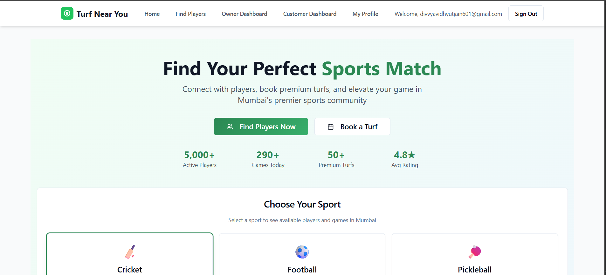
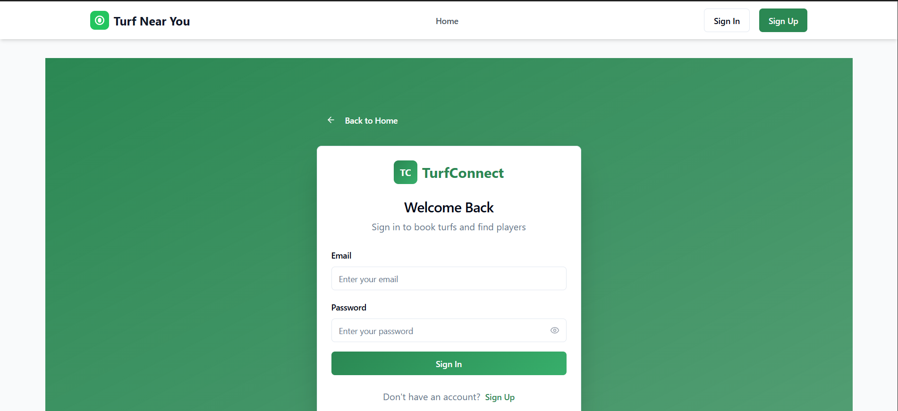
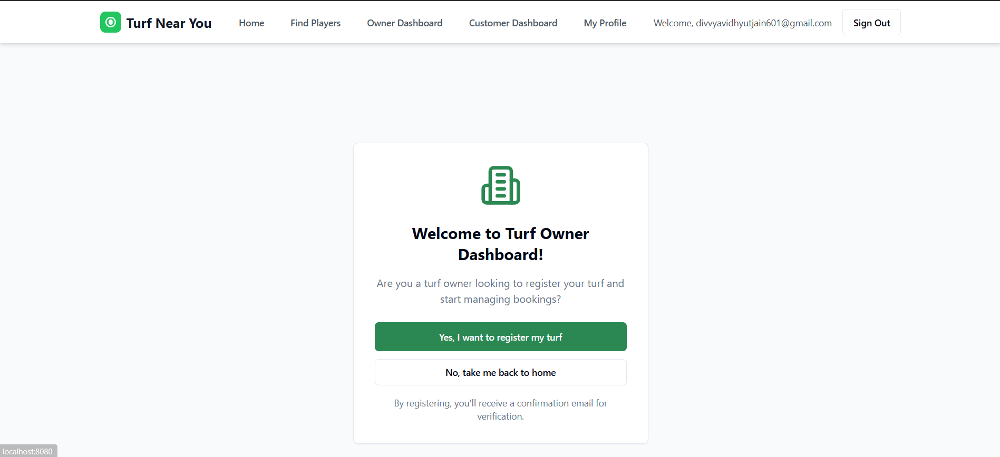
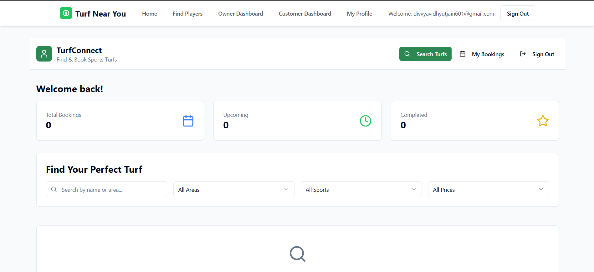
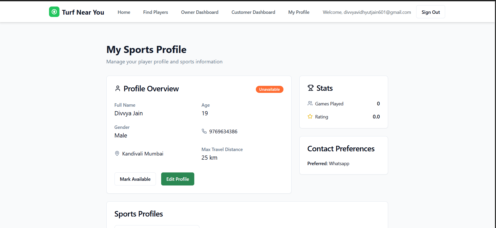
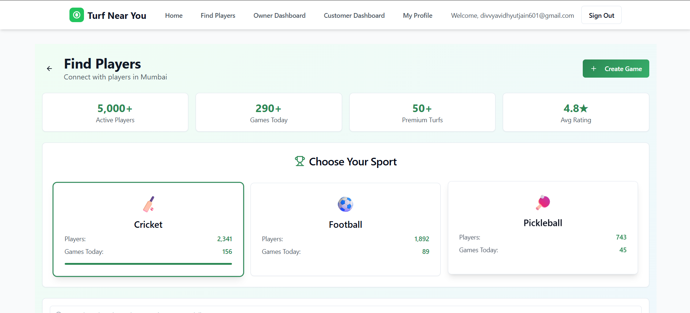

# Turf-Near-You 🏏

A modern sports facility management platform that connects sports enthusiasts with turf facilities. Built with React, TypeScript, and Supabase.

## 🌟 Features

- **Role-Based Authentication**
  - Separate interfaces for customers and turf owners
  - Secure phone number verification
  - Protected routes based on user roles

- **Customer Features**
  - Browse available sports facilities
  - Book slots in real-time
  - View booking history
  - Find and connect with other players
  - Manage personal profile

- **Owner Features**
  - Manage facility listings
  - Handle booking requests
  - View analytics and reports
  - Update facility information
  - Manage availability

## 🛠️ Tech Stack

- **Frontend**
  - React
  - TypeScript
  - Tailwind CSS
  - shadcn/ui components

- **Backend**
  - Supabase
  - PostgreSQL
  - Real-time subscriptions

- **Authentication**
  - Supabase Auth
  - Phone number verification
  - Role-based access control

## 📸 Screenshots

### Home Page


### Authentication


### Owner Dashboard


### Customer Dashboard


### Profile Page


### Booking Interface


## 🚀 Getting Started

### Prerequisites

- Node.js (v14 or higher)
- npm or yarn
- Supabase account

### Installation

1. Clone the repository
```bash
git clone https://github.com/Divvyaj15/Turf-Near-You.git
cd Turf-Near-You
```

2. Install dependencies
```bash
npm install
# or
yarn install
```

3. Set up environment variables
```bash
cp .env.example .env.local
```
Fill in your Supabase credentials in `.env.local`

4. Start the development server
```bash
npm run dev
# or
yarn dev
```

## 🏗️ Project Structure

```
src/
├── components/     # Reusable UI components
├── contexts/       # React contexts
├── hooks/         # Custom hooks
├── pages/         # Page components
├── types/         # TypeScript types
└── utils/         # Utility functions
```

## 🔑 Key Features Implementation

### Authentication Flow
- Phone number verification
- Role-based access control
- Protected routes

### Booking System
- Real-time availability checking
- Booking confirmation
- Payment integration (coming soon)

### User Profiles
- Customer profiles
- Owner profiles
- Facility management

## 🤝 Contributing

Contributions are welcome! Please feel free to submit a Pull Request.

1. Fork the repository
2. Create your feature branch (`git checkout -b feature/AmazingFeature`)
3. Commit your changes (`git commit -m 'Add some AmazingFeature'`)
4. Push to the branch (`git push origin feature/AmazingFeature`)
5. Open a Pull Request

## 📝 License

This project is licensed under the MIT License - see the [LICENSE](LICENSE) file for details.

## 👥 Authors

- **Divvya Jain** - [GitHub](https://github.com/Divvyaj15)

## 🙏 Acknowledgments

- [Supabase](https://supabase.io/) for the backend services
- [Tailwind CSS](https://tailwindcss.com/) for the styling
- [shadcn/ui](https://ui.shadcn.com/) for the UI components

## 📞 Contact

Divvya Jain - [LinkedIn](https://www.linkedin.com/in/divvya-jain-16486b302)

Project Link: [https://github.com/Divvyaj15/Turf-Near-You](https://github.com/Divvyaj15/Turf-Near-You)
